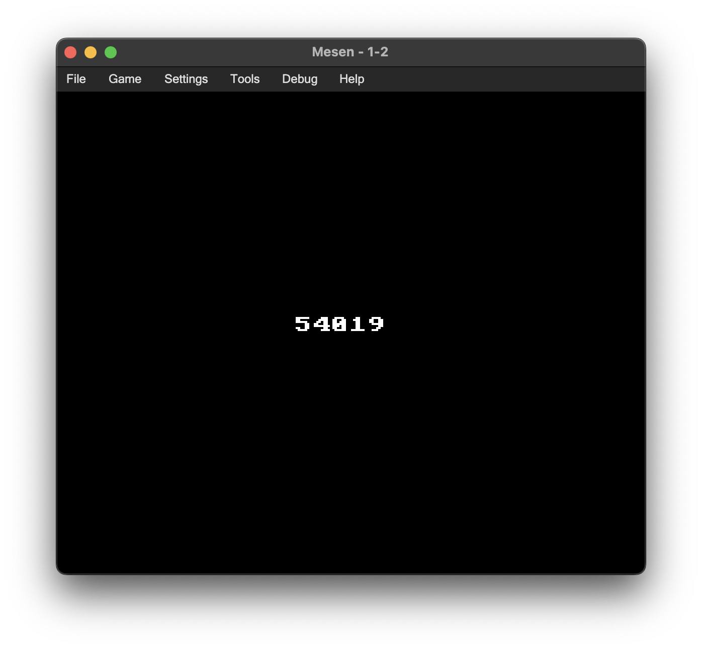

# AoC 2023 1-2 in NES-compatible 6502 Assembly
* [Advent of Code 2023 Day 1 Part 2](https://adventofcode.com/2023/day/1#part2)

## Preparation
* Copy your unique input into `1-2.txt` in the project root.
## Building
* Simply run `make`
    * Requires `ca65`, `ld65`, and `clang` to be included in your PATH.
## File Summary
* `1-2.s`
    * Complete source code in 6502 assembly.
* `1-2.bin`
    * Reformatted input in binary format (no preprocessing).
* `nes.cfg`
    * Linker configuration for basic [NES NROM](https://www.nesdev.org/wiki/NROM) rom file.
* `1-2.nes`
    * Prebuilt rom file.